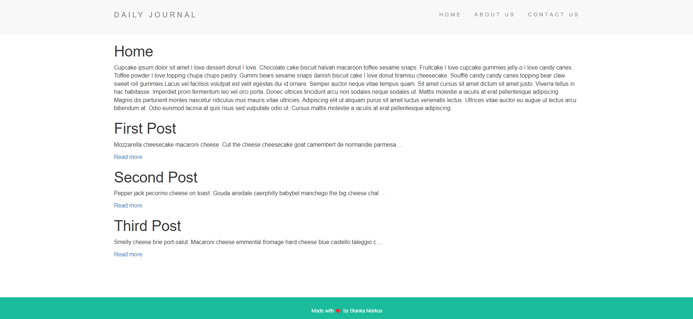

## Blog Website
This is a blog website built using Node.js and Express.js. It allows users to create, view, and share blog posts on various topics.
## Demo




## Features

- Home Page: Displays a list of blog posts with their titles and summaries.
- Post Page: Shows the full content of a specific blog post.
- About Page: Provides information about the website and its purpose
- Contact Page: Allows users to get in touch with the website owner.
- Compose Page: Lets users create new blog posts by entering a title and content.
- Dynamic Routing: Each blog post has its unique URL based on the post title.
- Responsive Design: The website is optimized for various screen sizes, including mobile devices.


## Installation

To install and run the application locally, follow these steps:

1.Clone the repository:
```bash
  git clone https://github.com/MarkusBlanka/Blog_Website.git
```
2.Navigate to the project directory:
```bash
  cd <project directory>
```
3.Install dependencies: 
```bash
  npm install
```
## Run Locally

To run the application locally, use the following command:

```bash
  npm start
```
Once the server is running, you can access the application by visiting http://localhost:3000 in your web browser.


## Usage

- Home Page: View a list of existing blog posts and click on a post to read its full content.

- Post Page: Access a specific blog post by its unique URL and read the complete content.

- About Page: Learn more about the website and its purpose.

- Contact Page: Fill out the contact form to send a message to the website owner.

- Compose Page: Create a new blog post by entering a title and content. Submit the form to publish the post.


## Dependecies

- Express.js: Fast, unopinionated web framework for Node.js.
- EJS: Embedded JavaScript templates for rendering dynamic web pages.
- Body Parser: Middleware to handle HTTP request body parsing.
- Lodash: Utility library providing helpful functions for JavaScript.
## Acknowledgements

- This project was created as part of the Web Development Course on Udemy.
- Thanks to the course instructor and team for providing valuable guidance and resources throughout the development process.
